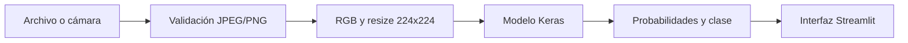

# Clasificador de hojas de tomate

Aplicación educativa de inferencia que usa Streamlit y un modelo TensorFlow/Keras incluido en el repositorio. Recibe una foto de una hoja de tomate, la prepara para el modelo y muestra la clase seleccionada junto con las probabilidades de las cuatro salidas configuradas.

> Este proyecto no reemplaza el diagnóstico de un profesional agrónomo ni de un especialista en sanidad vegetal.

## Problema y contexto

El proyecto explora un flujo completo de clasificación visual: captura de entrada, validación y preprocesamiento de imagen, inferencia con un modelo entrenado previamente y presentación comprensible del resultado.

El repositorio contiene la aplicación de inferencia y el artefacto del modelo. No contiene el pipeline de entrenamiento, el dataset ni una evaluación del rendimiento del modelo.

## Solución

La interfaz permite subir una imagen o usar la cámara del dispositivo. La aplicación:

1. acepta únicamente archivos JPEG o PNG de hasta 10 MB y 25 megapíxeles;
2. verifica el archivo con Pillow y lo convierte a RGB;
3. redimensiona la imagen a `224 × 224`;
4. ejecuta el modelo Keras en el servidor;
5. valida que existan cuatro salidas y las convierte a probabilidades si fueran logits;
6. presenta la clase principal y el detalle por clase.

## Funcionalidades implementadas

- carga de archivos JPG, JPEG y PNG;
- captura desde la cámara mediante Streamlit;
- modelo cargado una sola vez con `st.cache_resource`;
- preprocesamiento reproducible a RGB y `224 × 224`;
- control de tamaño, dimensiones y formato antes de la inferencia;
- resultado principal, confianza y probabilidades por clase;
- mensajes de error genéricos para no exponer detalles internos.

## Stack técnico

- Python 3.11
- Streamlit 1.58.0
- TensorFlow CPU 2.21.0 / Keras
- Pillow 12.3.0
- NumPy 1.26.4

Las versiones exactas están fijadas en `requirements.txt`.

## Arquitectura



El modelo está en `models/modelo_hojas_tomate_mobilenetv2.keras`. El grafo incluido contiene una base MobileNetV2, preprocesamiento interno y una salida softmax de cuatro unidades.

## Clases configuradas

La aplicación interpreta las cuatro posiciones de salida en este orden:

1. `Tomato___healthy` — hoja sana
2. `Tomato___Early_blight` — Early Blight
3. `Tomato___Late_blight` — Late Blight
4. `Tomato___Leaf_Mold` — Leaf Mold

Este mapeo está definido en `app.py`. El repositorio no incluye los artefactos de entrenamiento necesarios para comprobar de forma independiente el orden semántico usado durante el entrenamiento.

## Ejecución local

Requisitos: Python 3.11 y Git.

```powershell
git clone https://github.com/nicodf91/clasificador-hojas-tomate-streamlit.git
cd clasificador-hojas-tomate-streamlit
python -m venv .venv
.\.venv\Scripts\Activate.ps1
python -m pip install -r requirements.txt
python -m streamlit run app.py
```

En macOS o Linux, la activación equivalente es `source .venv/bin/activate`.

## Variables de entorno

La aplicación no requiere variables de entorno, API keys ni credenciales.

## Seguridad y privacidad

- las imágenes se procesan en memoria y el código no las guarda en disco ni las envía a servicios externos;
- la entrada se limita por bytes, píxeles y formatos de decodificación;
- el modelo es un artefacto fijo controlado por el repositorio, no una carga del usuario;
- los detalles de excepciones se registran en el servidor y no se muestran en la interfaz;
- `.streamlit/secrets.toml`, archivos `.env` y credenciales locales están ignorados por Git.

Los límites de concurrencia y rate limiting dependen de la plataforma donde se despliegue la aplicación.

## Decisiones técnicas

- `st.cache_resource` evita recargar el modelo en cada interacción.
- No se divide manualmente la imagen por 255 porque el modelo incluye una capa de reescalado.
- `compile=False` carga sólo lo necesario para inferencia.
- La allowlist de formatos evita que una extensión permitida habilite decodificadores de formatos no utilizados.

## Limitaciones actuales

- No hay dataset, métricas, benchmarks ni código de entrenamiento en el repositorio.
- No se puede afirmar accuracy, F1 ni capacidad diagnóstica a partir de la evidencia disponible.
- Las fotografías fuera de las condiciones del entrenamiento pueden producir resultados poco confiables.
- No hay tests automatizados ni monitoreo de inferencia.
- No hay una URL de demo funcional verificada en la metadata pública del repositorio.

## Habilidades demostradas

- integración de inferencia TensorFlow/Keras en una interfaz web;
- manejo y validación defensiva de imágenes;
- transformación de salidas del modelo a probabilidades interpretables;
- gestión reproducible de runtime y dependencias Python.

## Estado del proyecto

**Demo educativa / prototipo de inferencia.**

## Estructura

```text
.
├── .streamlit/config.toml
├── app.py
├── models/
│   └── modelo_hojas_tomate_mobilenetv2.keras
├── requirements.txt
└── runtime.txt
```

## Autoría y contexto

Proyecto de portfolio de Nicolás De Felippe. El repositorio documenta y permite revisar la aplicación de inferencia y el modelo distribuido; no atribuye en este README un dataset, métricas o proceso de entrenamiento que no estén presentes.
